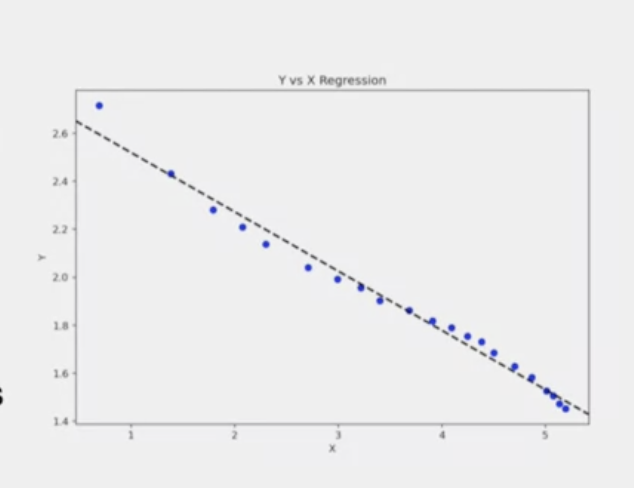
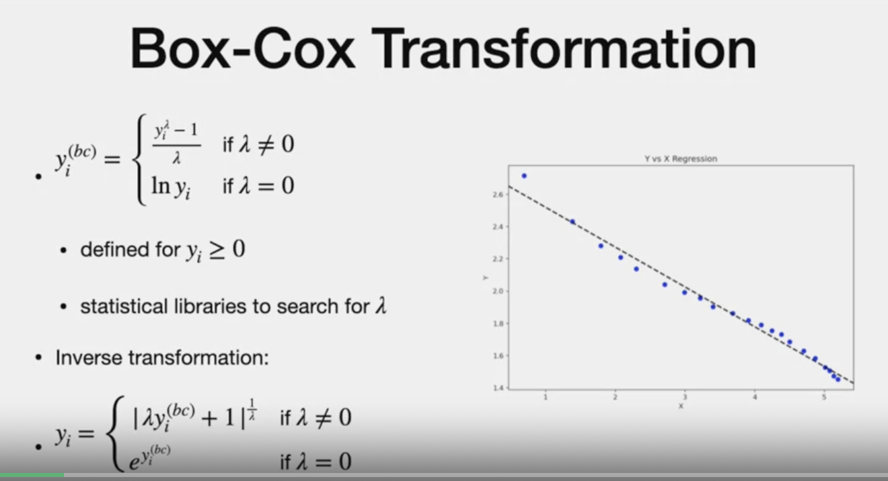
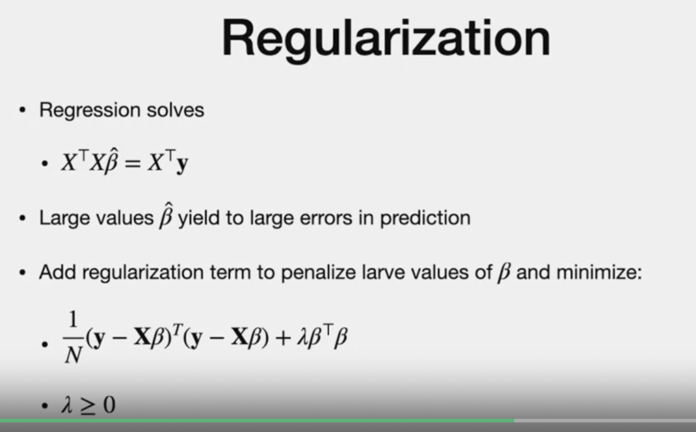
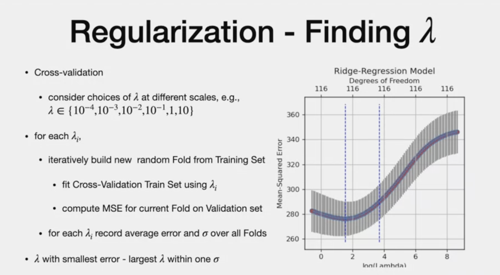
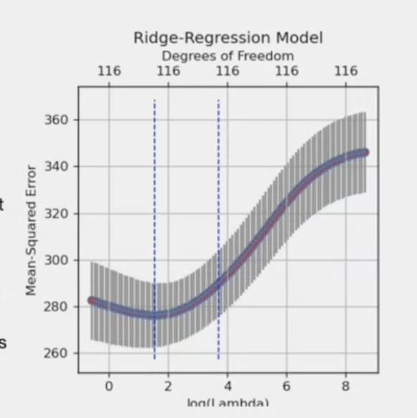

# Linear Regression Transformation

# Agenda

Box cox : Non-normal dependant variable into normal shape
regularisation - when high colerration between independant variables

#  Why Transofmration

- LR that has low R2 can be improved with transformation
- plotting is an option to see the fit (if one explanatory variable). To find if polynomial or log will fit better
- figure has low R2 0.59 (more pattern than outlier)

**Two option**
- Box - applied to dependant or independant variables
- Plynomial - applied on dependant variable

-refer figure below with 0.98 R2
- derived from previous plot by applying log function 

# 1.Box Cox Transformation
-  Non-normal dependant variable into normal shape
-  transform dependant "y" "y(bc)"
  
**Case 1**
  - exponent lambda for lamba not euqal to zero
- 
**Case 2**
  for lambda of zero, it is log of "y"

**Note**
- **only for y >0**
- If y is negative, offset can be applied before transformation and removed aftter transformation

**Find lambda to make residual look like normal distribution**
- we can use max likelihood
- statisc library to search best lambda (in programming assignment)

**Note:**
 - after Applying box -cox, we need to transform our regression back to original form (Inverse Transformation)
  

- they come from original case

# 2. Polynomial
- this is when the independant variable is dependant on "higher degree value' of independant variable
- like polynomial
- 
- figure shows the y fit "x" of degree "3"

- Note how Linear regression and polynomial regression functions are
- simple replace with higher degree independant variable in the equation
- This was quadratic polynomial.
- we can add as many powers 
- We can apply LR and predict co-eff
- Example ; height vs. weight. height cannot be proportional. but, can be applied to higher order

**How many terms to introduce**
- if we introduce many  higher order variable, we might overfit and even fit "outliers". so we need to know when to stop so "test" data is fitted well

# regularization
- two or more explanatory variables are co-related
- meaning one explanatory variable can be obtained from the other

- When two explanatory are co-related, then the "xTx" can have small eigen values.
- what that means is xTxBeta is also the spprxomimately same as betahat + some unknown number.
- this can cause betahat to be huge.
- like classification, we need to find a betahat that is low and stil have reduce the error for good fit

- We are adding term to minimize error in prediction
- This is "Regularization term" thta penalizes large value of beta
- it is lambda >=0. equal to zero mean "No" regularization
- 

**Note**
- This type of regulariaztion uses "L2 NORM" and it is called "RIDGE regression"
- We also have "L1 norm" for Lasso (Later)

- differentiating by beta and equating to zero gives our function

# Finding Lambda
- through cross validation on training set
- different scale 10 to power -2 to -10..
- same as classification, fold (cross validation training and validation set)

We record the standard deviation as well in addition to lambda

> **Good lambda is the one that gives smallest error and within "1" standard deviation
**

- figure shows for co-efficient 116, the log lambda values by mean square error,
- Blue dotted vertical range shows the good lambda range (1.5 - 3.5)

# Putting it together
- first, no transforamtion fitting
- if outlier, standardized residuals vs. cook' distance and remove outliers (high levberage, larger than 2 std. dev and high cook' distance)
- removing outlier is a cautious process(if it belongs to the process)
- is resulting plot is not linear, we can transform (box cox and plot to see how shape) or use polynomial
- finally, regularization through cross validation(lambda)

---
# THe End