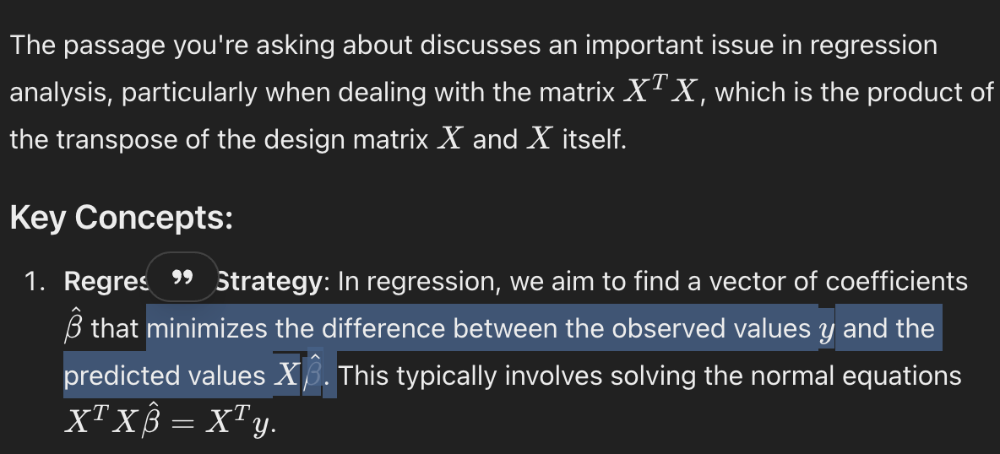
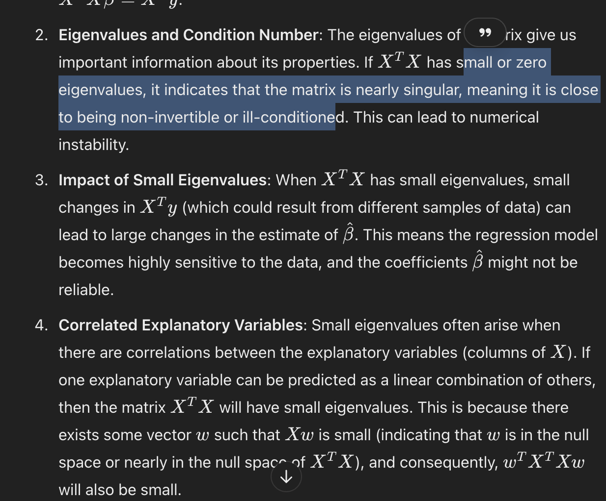
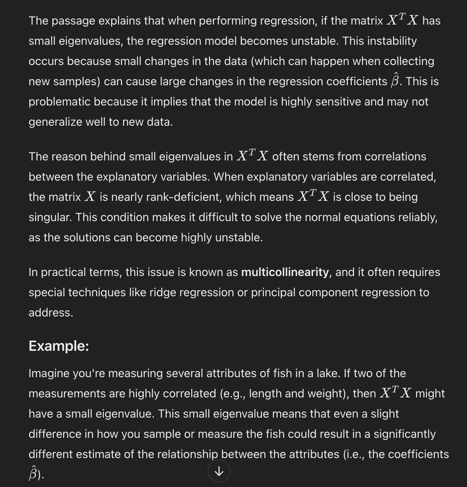

# Why is it needed?

# Explanation:

Issues:
- co-relation within explanatory variables
- small eigen values can make matrix invertible
- small eigen values lead to unreliable beta co-eff. (beta getting two large)
- we use same concept of classification to rintroduce penalty lamba to inimise error and also keep beta low.

