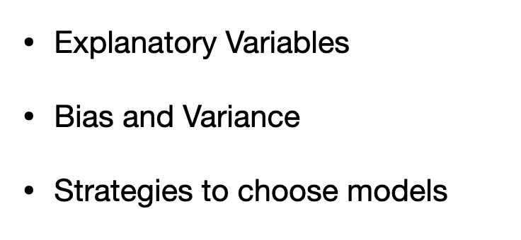
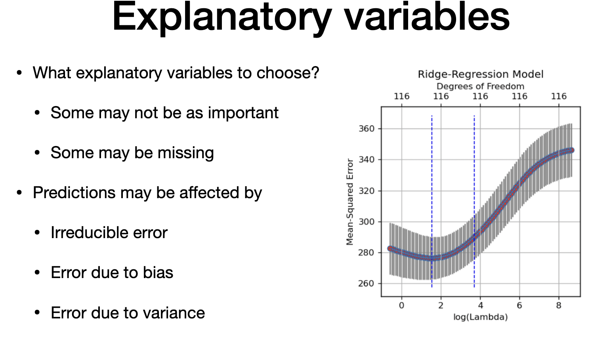
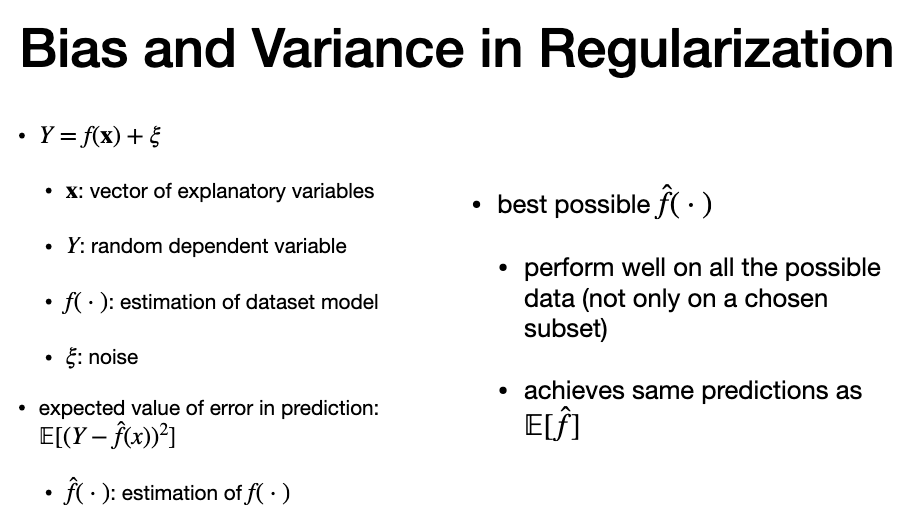
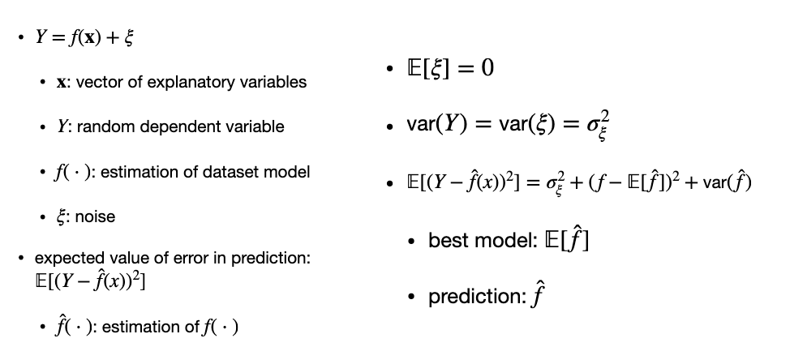
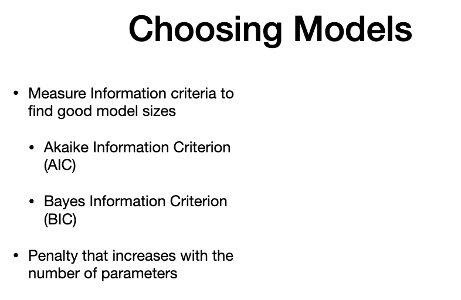
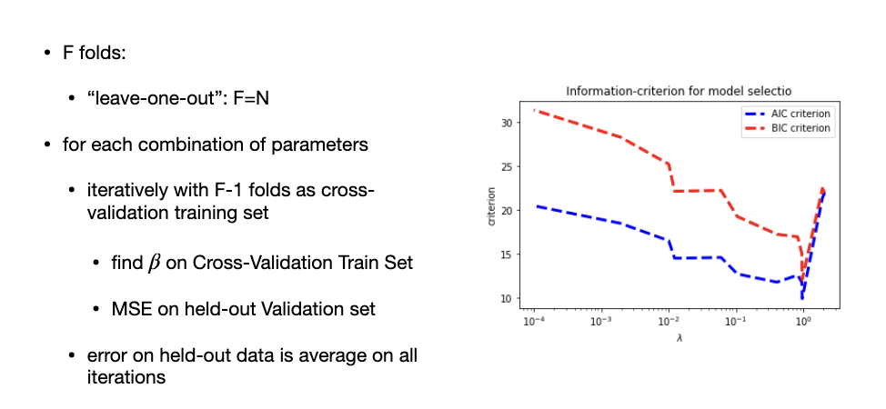
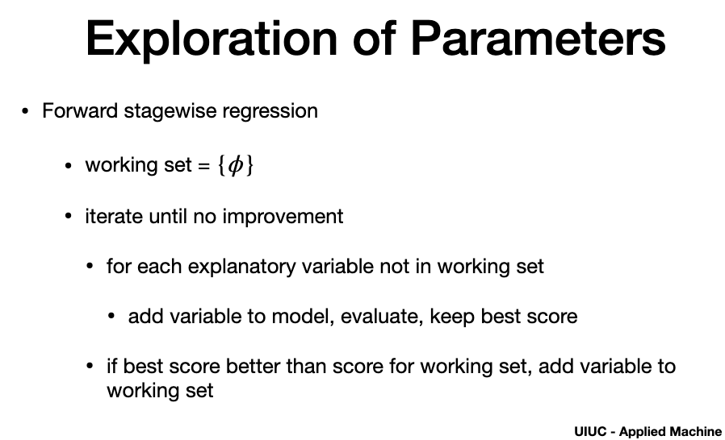
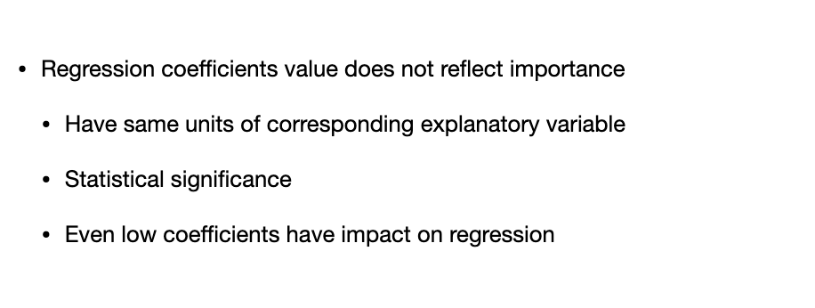

# Agenda

# Abt. explanatory variables

> - we need to identify required explanatory variables from the subset
> 3 kind of errors
> - Bias - underfitting - less variables - simple model and doesnt reflect the data
> - variance - complex models - more variables and specific - not generalize enough - overfitting

# Bias and variance

> - noise is independant of "x"
> - noise - mean of error and variance of sigma squared
> - fhat -> predicion
> "All possible data" - just not on training data
 

> - variance of y is same as noise = sigma squared
>  3 components
> 1. variance of fhat => variance
> 2. bias is (f -Expected value of fhat SQUARED)
> 3. sigma squared => irreducible error

> - explained earlier...

# Choosing model

> - penalize the number of parameters by adding to training error
> - we already discussed hinge loss (we have another regularization, lasso)
> - both tools use cross validation (information criteria and regularization)

# AIC , BIC (Akaike and Bayes Information Criteria)

> - "k" parameers
> -"Log likelihood"
> - "AIC MIGHT HAVE MORE PARAMETERS ESTIMATED, But has strong theory"
> - "N" for BIC is size of dataset
> - "d" - number of co-eff
> - usually has statiscial methods to calcualte AIC and BIC.

# Cross- validation

> - both becomes less when lamdda =1
> - use cross validation

# Exploration of parameters

> - to choose the variables, two greedy strategies
> - forward - starts with empty set

# Stagewise regression

- backward - starts with all variables and removes the variables

# variable importance

- if same variable in  "km" vs. "meters" , its significance changes (unit of measurement)
- even co-eff  is zero, it still might have an impact

---
# The end