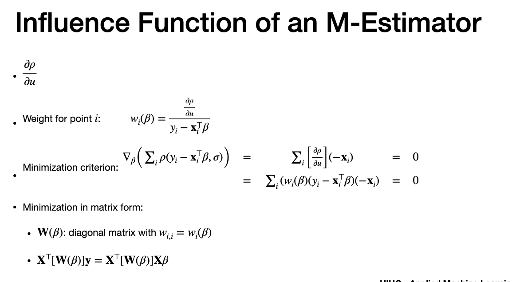
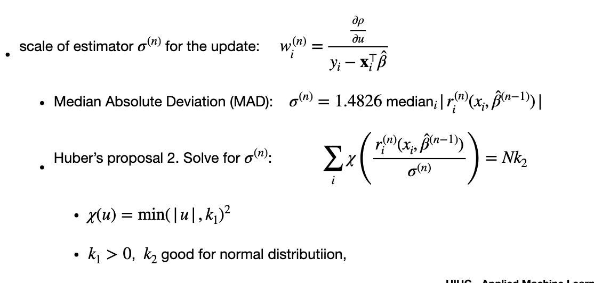

# Agenda

# Robust - to handle outlier

> - strategy to reduce outliers
> - outliers affect regression because of MSE and single point exerts large pull
> - remove outliers is not preferred
> - add weigh to each point. High residual have low weight(mostly outliers)

# M Estimators

> - r(i) : residuals
> -replace negative log likelihood 
> - that sign is called "rho"
> - "Huber loss" is used to minimization
> - its quadratic for "u" < sigma(threshold) - meaning grows fast for smal values and slow for large values
> - signma is threhold to identify inlier and outlier
> - you will not the derivative is not continous but is bounded by sigma
> - used in neural network

# Influence Functions

> - Influence function is the partial derivative of rho with respect to "u"
> - used to define "weight"
> - weight = infuence function/residual
> - Minimization = solve by using thr weight and equate to zero
> - minimization can be written in matrix form
> - in matrix, weight is in diagonal. Solve this minimization

# Solving regression

> - solve minimization criteria
> - we use "ITERATIVELY RECURSIVE/REWIGHTED LEAST SQUARE" method
> - initial beta can be found by feeding small training set.
> - then, we iterate.each step we find weight.
> - we estimate next Beta hat at step "n+1" by solving minimization criteria.

# Scale of Estimator

- scale = sigma
- Two methods to find the Scale
> #Method 1
> each find scale at each step of the minimization method and find "Median" , Not mean

> #Method2
> - this also accounts residuals, but with "k"
> two "k" values, 
> k1 : used for threshold | K2 : to ensure good normal distribution
> X(u) is higher - closer to standard deviation of data

---
# The end