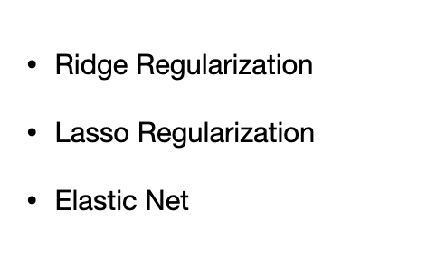
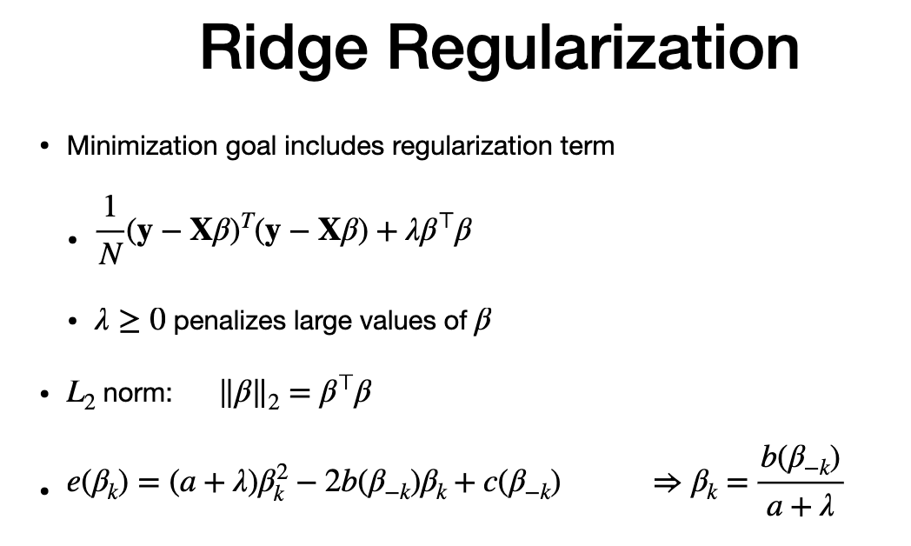
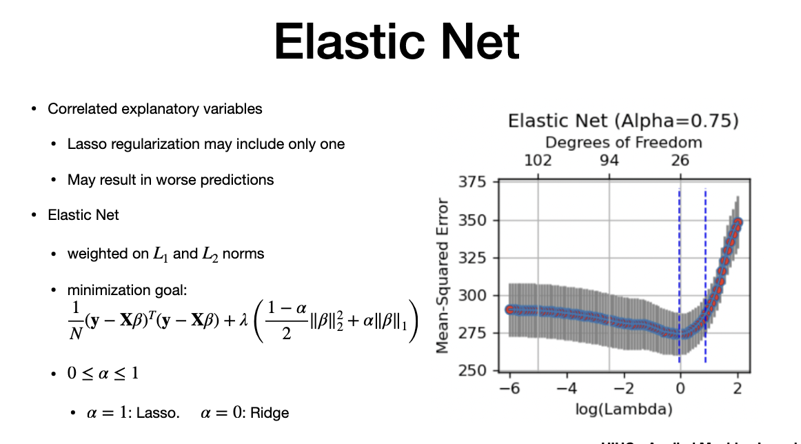

# Agenda

> - to minimize/select important variables
> - regularization that penalize large co-eff and remove explanatory

# Ridge

> - two or more explanatory variables are co-related
> - address using regularization
> - penalize large values of Beta
> - lamba - regularization ..appplied of squared
> - doesnot eliminate variables(means co-eff should be zero)
> - quadratic equation is the error. we equate to zero and solve for beta.
> - even if beta is  very small, to make it zero, we need a large value of lambda

# Lasso

- make zo-eff become zero
- force co-eff that has less impact to Zero
- penalty grows linearly , not quadratic
- use L1 norm
- "Stochastic gradient" - NOT GOOD to SOLVE
- statisc libraries used to solve the equation
- using cross validation, different lamba to make co-eff
- "Good for Sparse Model" goal

Note the graph - good way to show

- Top x-axis is "co-eff". it ranges from 1 to over 100
- Bottom x-axis - Log Lambda 
- y axis is MSE
- Lowest MSE is at lambda near zero (vertical lines are standard deviation)
- 'Path"- regularization to solve
- one co-eff goes down, other may go up - something to be cautious
> - CONS: many variables are co-related, Lasso choose one of them. sometimes it cause worst prediction

# ElasticNet

> - balance Ridge and Lasso
> - when alpha =1, it is a lasso , close the 0, it is ridge
> - weight can be altered using "alpha"
> - alpha is between 0 and 1.
> - - balance "remove some variables - lasso", but keep some co-related as in ridge
>  - more variables than lasso

---
# The end