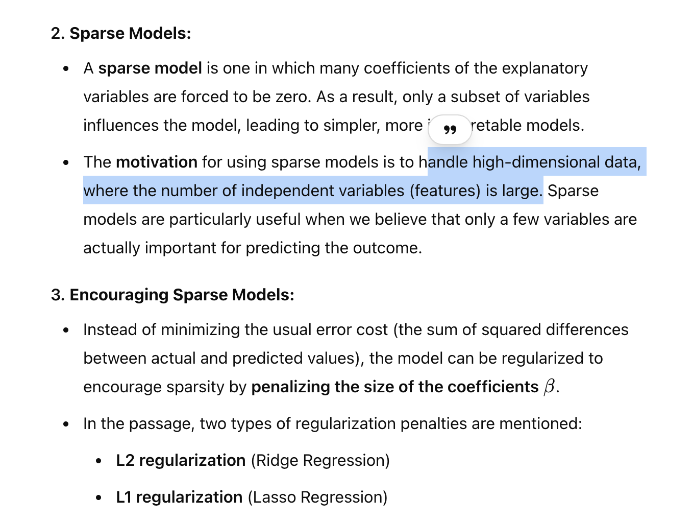
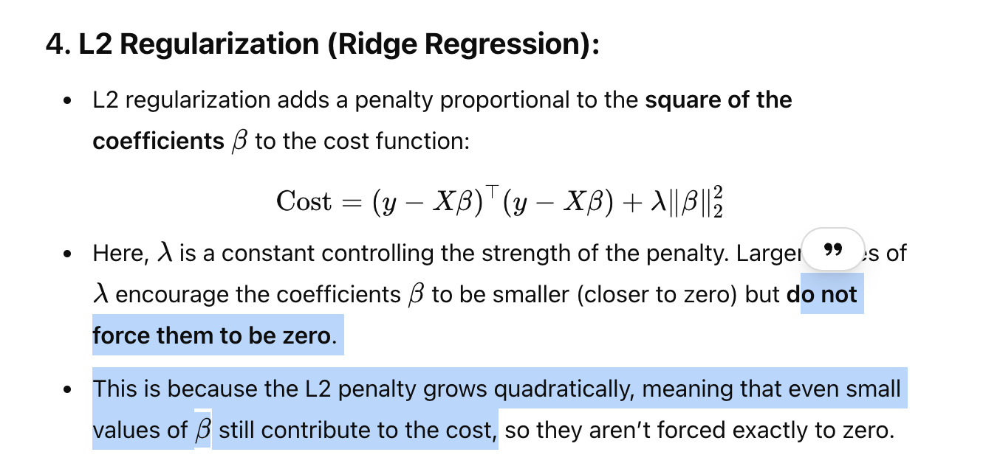
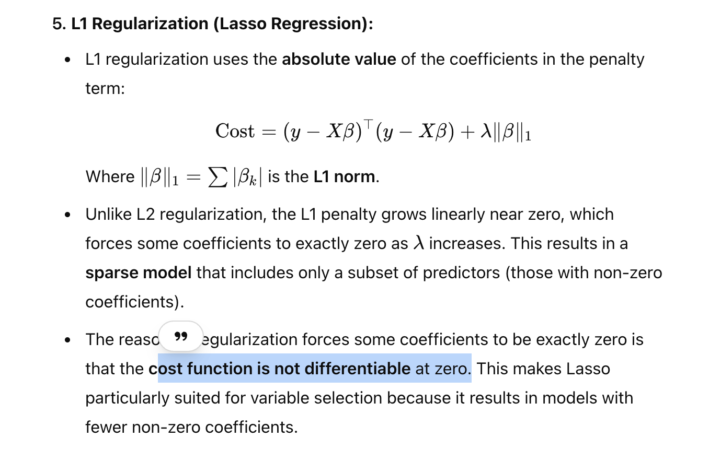
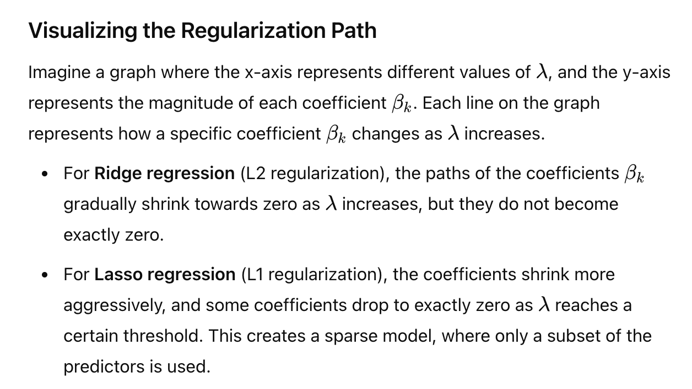

Page 263
# Lasso - Why and cmpare with Ridge

# Ridge

- Forces co-eff close to zero
  
# Lasso
- Forces co-eff to zero
- applicable for rank deficient matrix (cannot be inverted)
  
- 

# Choosing Lambda

# Why Lasso is better for High dimensional daa

# Regularization path

# Plotting regularization path

# Importance

