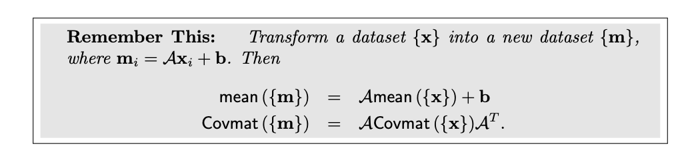
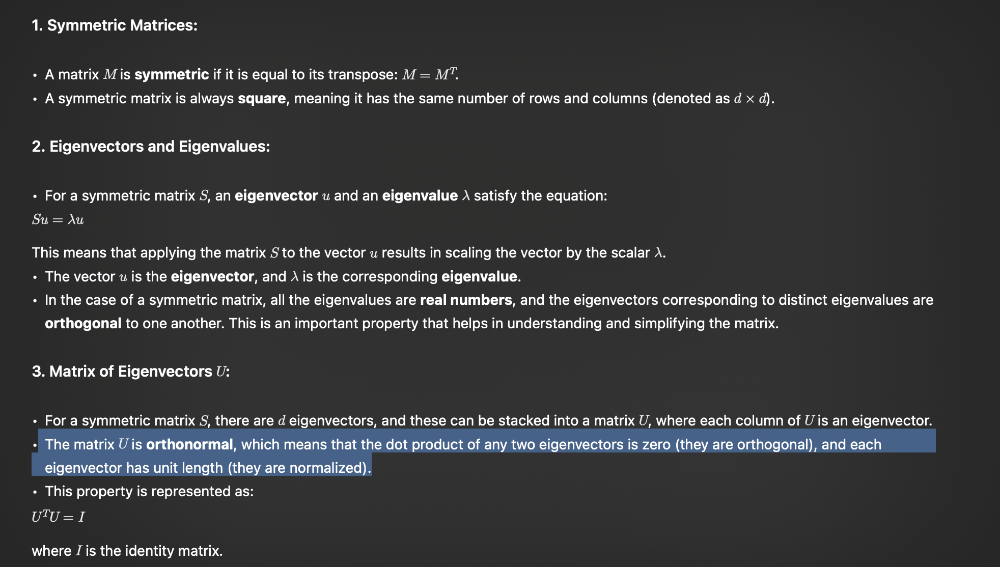
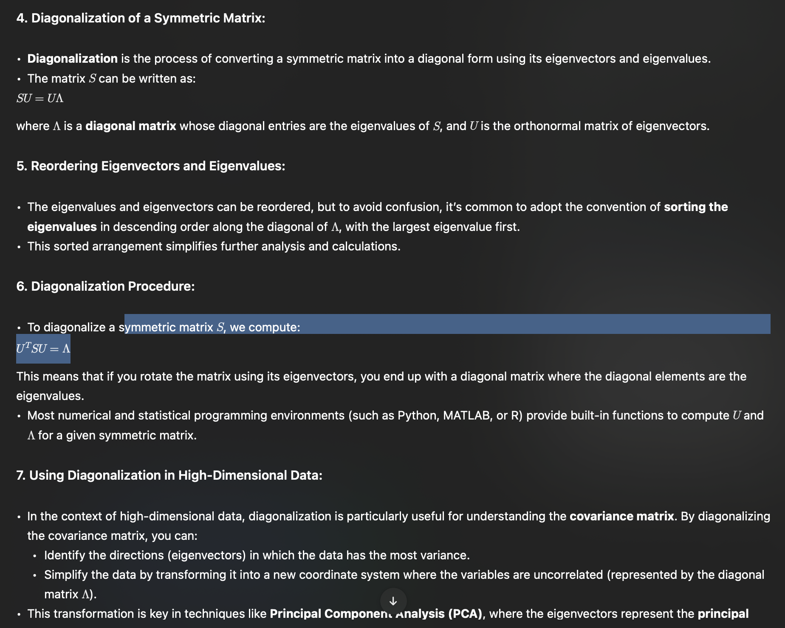
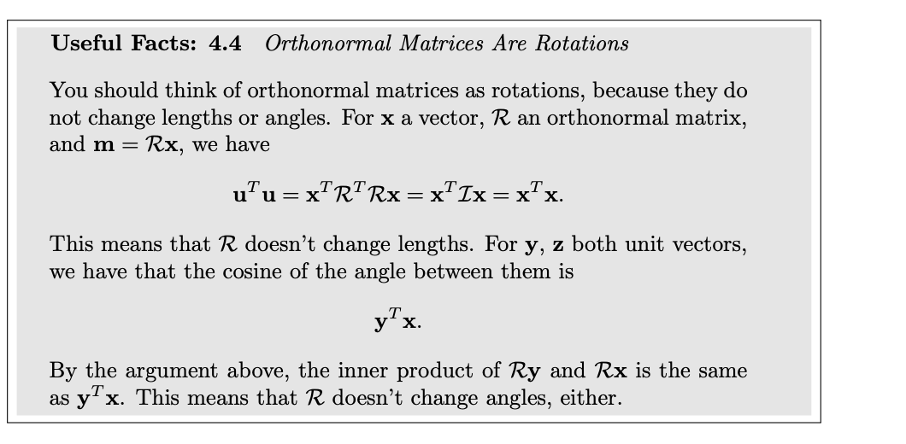

> An affine transformation of this data is obtained by choosing some matrix A and vector b, then forming a new dataset {m}, where mi = Axi + b. 

 

 ---
 # Eigen values and Eigen vectors
 

 

 