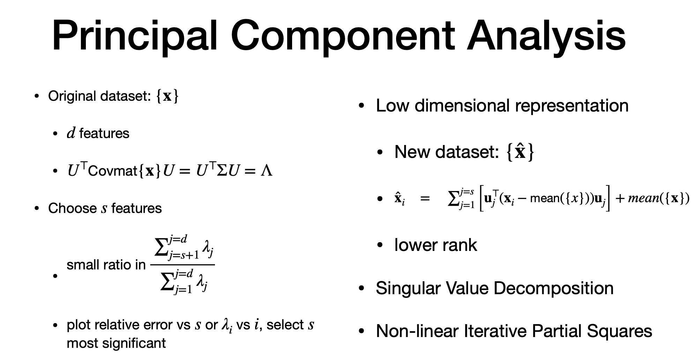
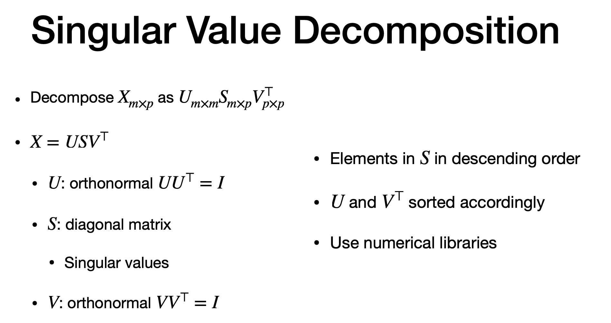
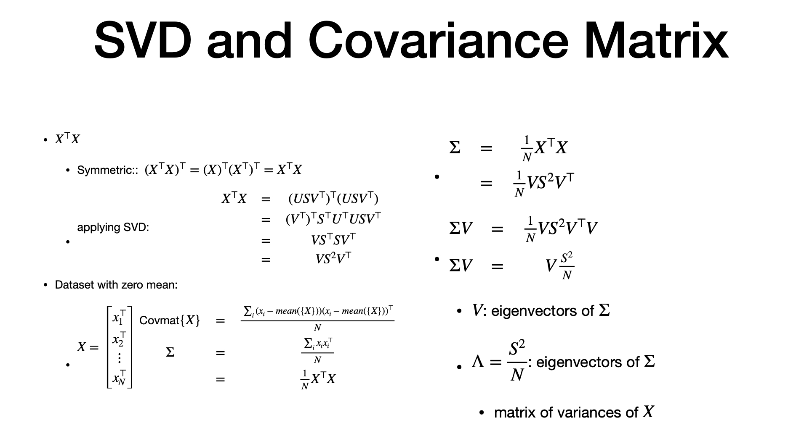
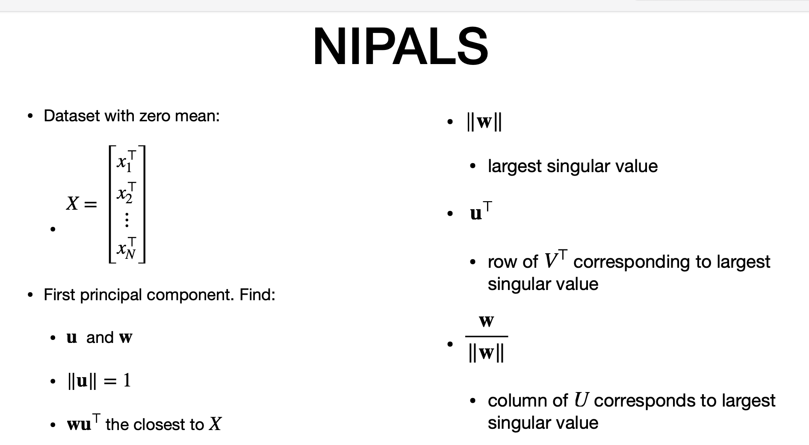
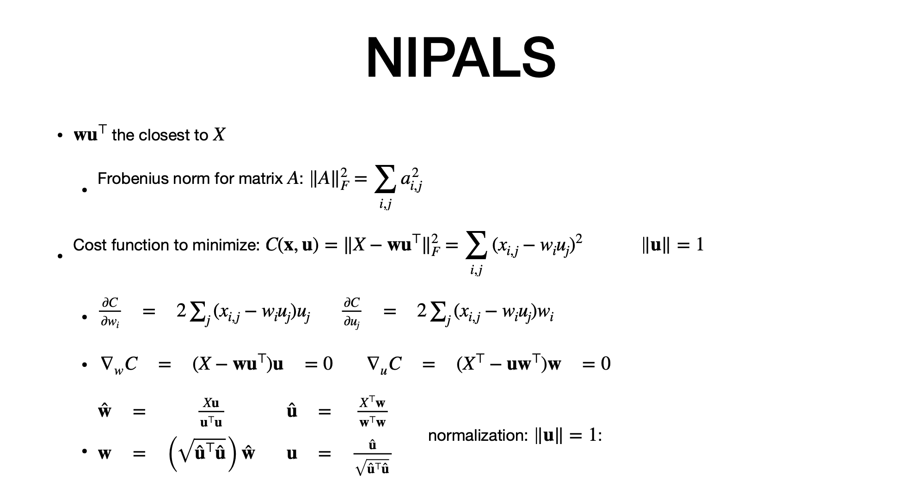
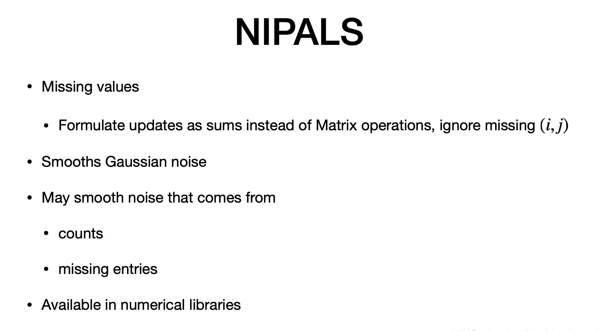

# Agenda

> - PCOA 
> - CCA 
> - SVD
> - NIPALS
> - For high dimesnional data

# Recap PCA

> - produce low dim of high dimension
> - "U" - eigen vectors and "lambda" is diagonal matrix of eigen values
> - sorted in desc, order matches with eoigen valeus and vectors
> - "s" - selected number of features
> small ratio for minimum error
> - plot to get lambda that is of good significance
> -"xhat' - new matrix - uses 's" out of "d'
> - xhat has low rank - meaning less dimensions
> - To computer low rank approxomination, we can use SVD or NIPALS

# SVD

> - decompose "X" to left matrix (U), right matrix (V)and eigen values diagonal(S)
> - U  and V is orthonormal
> - S - has non negative - singular values
> - different decompsoiton can be achieved
> - sort singular values in different ways
> - U and V transpose - starting to look like diagonalizatio  of covariance matrix.

# SVD and Co-variance

> - extend SVD to PCA
> - X transpose * X
> - replace the decompisition in place of "X"
> - U tranpose * U = identity ..so removed
> - final = V * S squared * V transpose
> - dataset "x", "N" data items, zero mean
> - X squared / number = covariance
> - = Since X transpose * X = V * S squared * V transpose, we replace that in second column math
> - multiple  both side by "V"
> - V trapose * V = identify, 
> - V = matrix of eigen vectors
> - so, lambda (eigen value) = S square/N = S sqaure = diagonal
> - we dont use "U"

---

# NIPALS  - Intro

> - iterative method to obtain some of the largest prinicipal component
> -  we get partial single value of "x"
> - "x" too large to apply SVD or PCA directly
> - No need of Co-variance
> - X -= data set - zero mean
> - goal = get first princupal componennt
> - we assume until vector "u" and vector "w"
> - w * U transpose = close as possible to "x"
> - "w" = largest singular value
> (w / norm of w) = columne of "u" that is largest singular value

# More on NIPALS

> - Forbenius norm = cost = sume of all square elements
> - goal - munimise frobenuis norm
> - "c" cost  = minimise [ actual - (w * U)]
> - constraint this for "u" vector with unit vector to minimise the family of solution
> - gradient of cost function and equate to zero
> - partial derivative of cost
> - w.r.t "u" and "w"
> - equate partial derivative to zero.
> - ignore constant
> - resolve "w" and ""u in terms of "x"
> - final step is normalization 

# Algorithm

> - for finding next priniciapl, we iterate
> - step 0 - initializ at random
> - continue until convergence (point when previous setp and current is minimal)
> - just use previous step and get next step
> - result is "w" - larest singular value. "u transpose" which is row of "V tranpose"
> - for 2nd PCA -  we use X(1) from result of "X" and "our approx (w * u_tranpose)"
> - so it is iterative
> - CONS: It is an "APPROX' algorithm. if rpev and next is smaller than threshold, we stop
> - more PCA , we obtain more significant the error is
> - we can get low rank representation

# Missing values

> - robust method
>  - works with missing values
> - cost function as matrix multiplication
> - cost can be in sum form - simply ignore missing value in the sum
> - these low rank representation that resuls "Smooth gaussian noise (pros)
> - Also smooth  noise from missing data (Pros) as long as missing is not significant

----
# The end