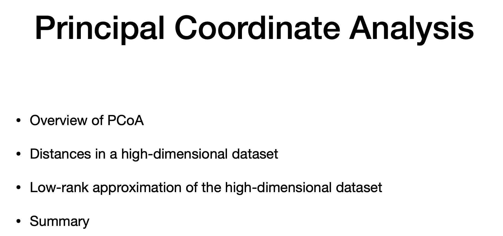
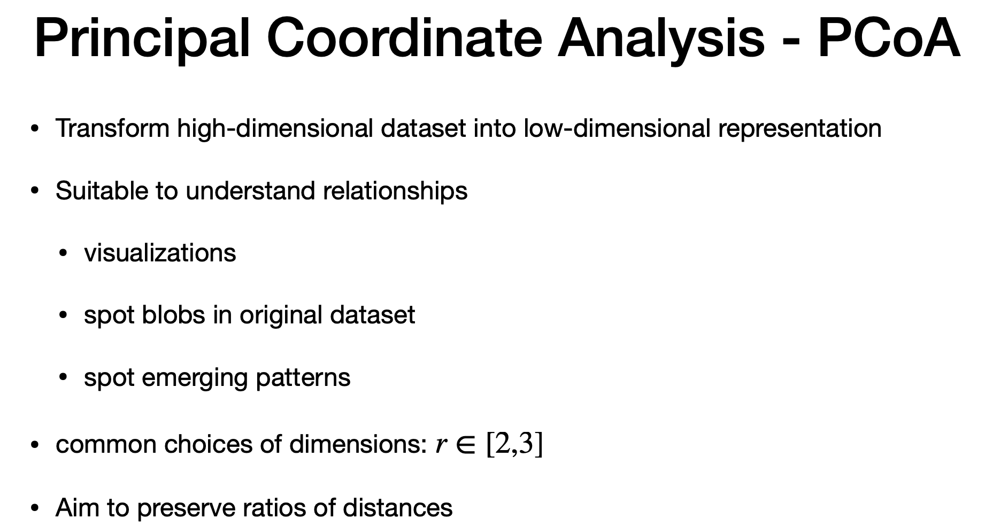
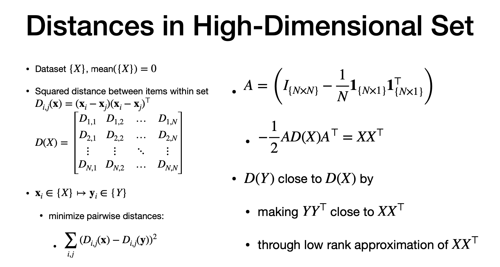

# Agenda

> - "Co-ordinate"
> - hi -dim dataset  for lo-dim dataset
> - low rank approc of original dataset

# What is PCOA?

> - relationship of data items
> - spot blobs and patterns
> - small "r"n dimension (usually 2 or 3) 
> - planar - r =2
> - for 3-d representation, r=3
> - refelect ratios of distances
> - points far in hig dimension are far in "r-dim" representation and same for points closer to each other

# Distance in PCOA - Multi Dimesnional Scaling(MDS)

> - "N" data items
> - square distance between pair of elements
> - arrange distance as matrix
> - it has N rows and N columns
> - "x: input" | "y:output"
> - goal plot "y" so square distance is similar as x
> - mean of "x" is zero. (using affine transformation)
> - matrix "A" = centering matrix - removing ean fro vector , also used to computer co-variance
> - Apply centering matriz to "x" to compute co-variance
> - distance in target set "y" close to distance in roginal set 'x", but choosing y * Y_transpose close to (X * X_transpose)
> - it can done by low rank

# Low rank Approximation

> - now we are going to get low rank representation of X * X_transpose
> - SVD of "X" = U S V_trans
> - use this and replace in X * X_trans
> - Note S * S_trans . since singular , it is "S sqaured"
> - Low rank of "x" through math is y * Y_transp

# PCOA

> - "D" - distance matrix
> - "A" - centering matrix
> - if we dont know "x", still know distance between "x", we can still compute "w"
> - "u" - matrix of eigen vector
> -" lambda" = eigen value
> - "r" - target number of dimension
> - last step = make "y" target 

---

# The end