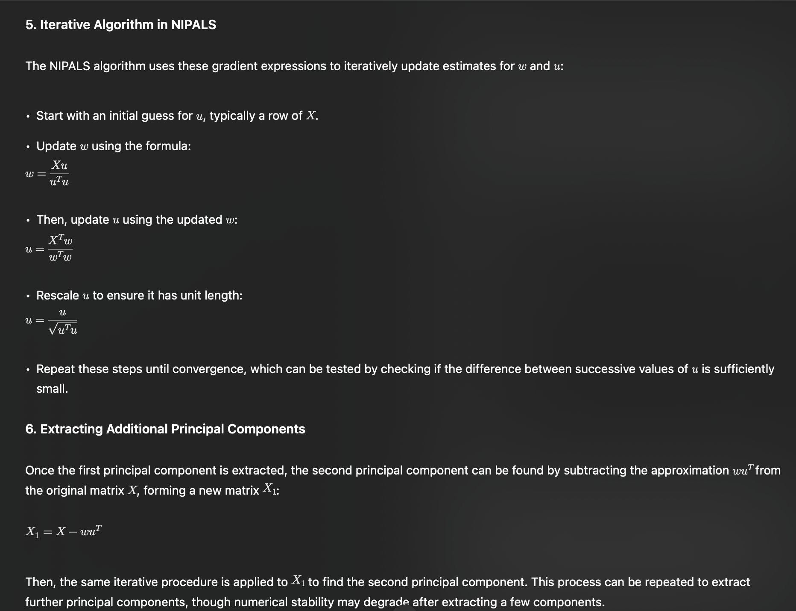
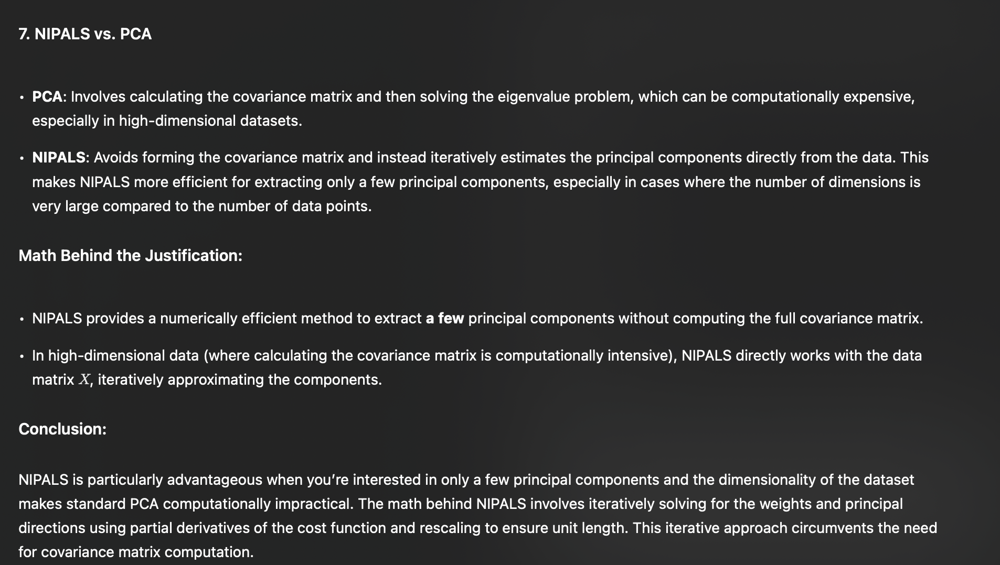

# Extracting a Few Principal Components with NIPALS
## page 99 - 101

# Intro
> NIPALS (Non-linear Iterative Partial Least Squares) and PCA (Principal Component Analysis) are both methods used to extract principal components from a dataset, but they differ in how they handle high-dimensional data and computational efficiency.

# Cost

# Iterative

# Comparison

---

# The end