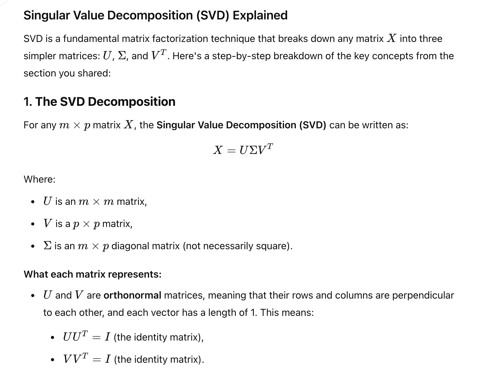
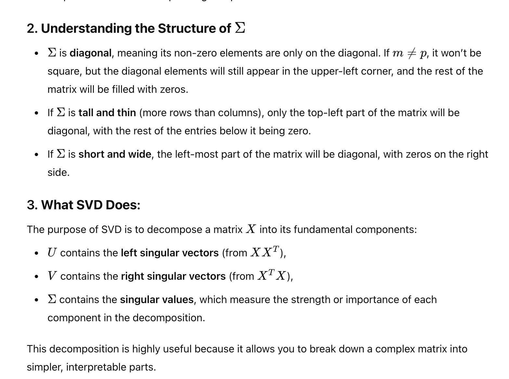
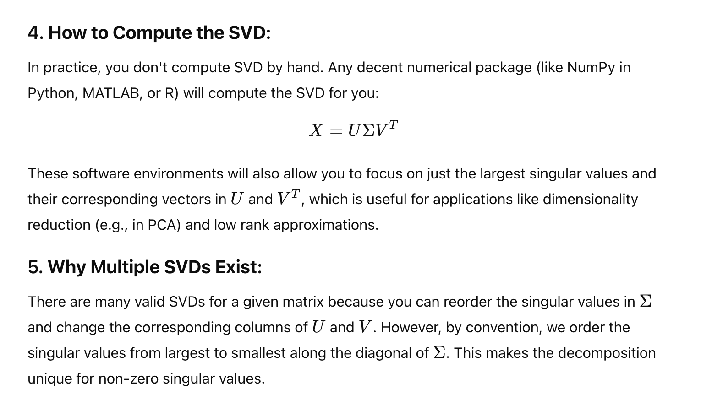
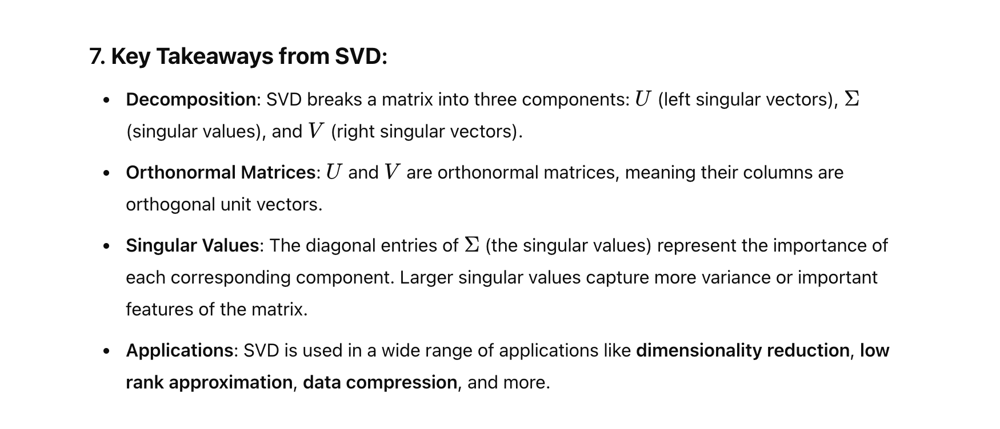

# SVD
Page 117 -118

# Why U and V?
- one is left and other is right
- 

# Computation

# relationship to diagonlization

- sigma is diagonal matrix which is squared in the equation (sigma transpose X sigma is sigma squared)
- The "X' matris is related to right matrix(V) and left matrix (U)

# Summary

# The end