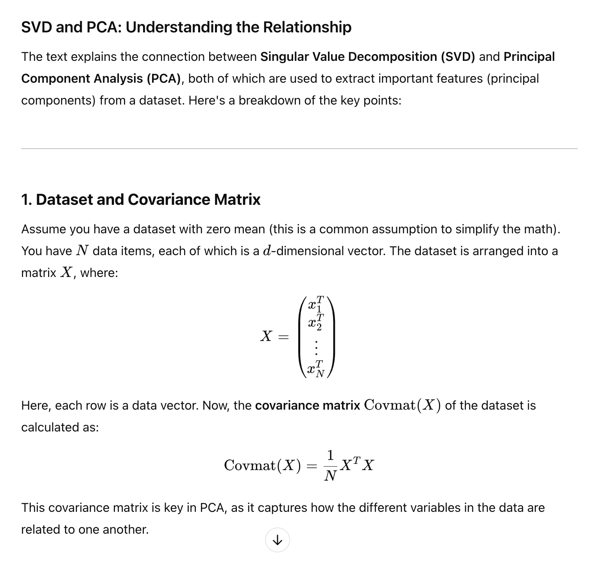
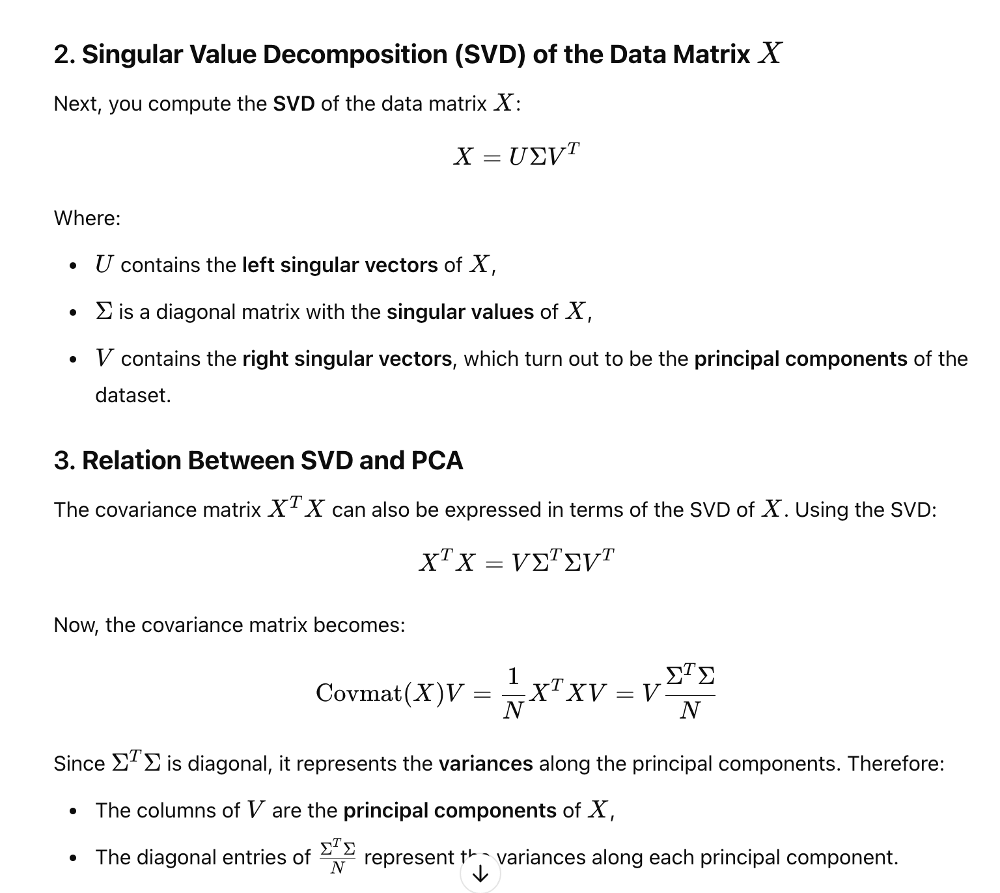
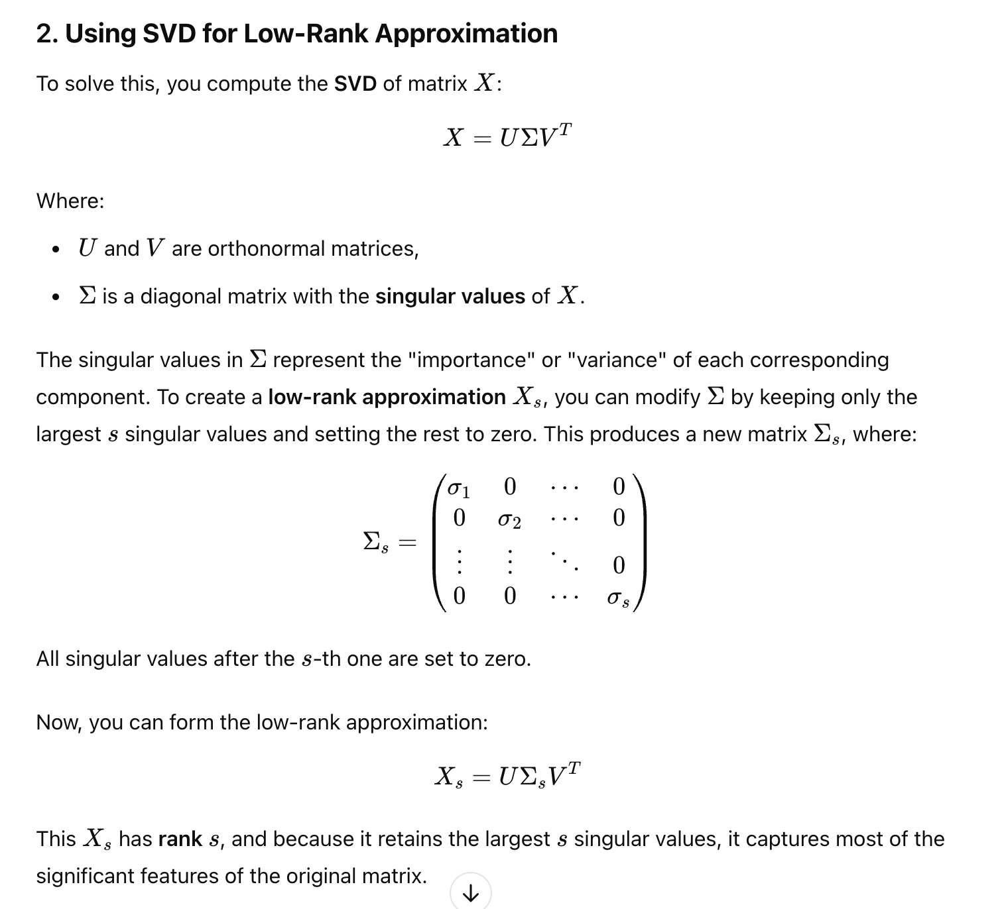

# SVA and PCA
## Page 119

## SVD

## Get PCA from SVD

## Nipals and SVD

## Summary

## SVD and Low rank approximations
## Page 120

# SVD  - Low rank

# SVD and Diagonal variance matrix

# Summary

# The end