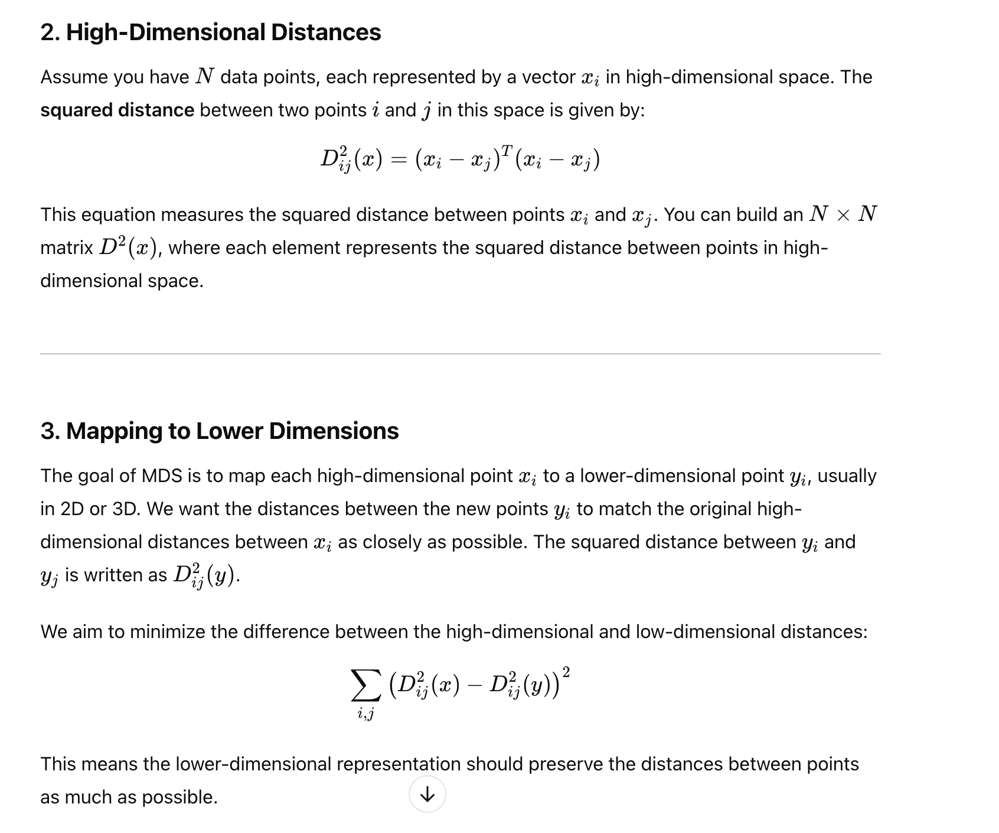
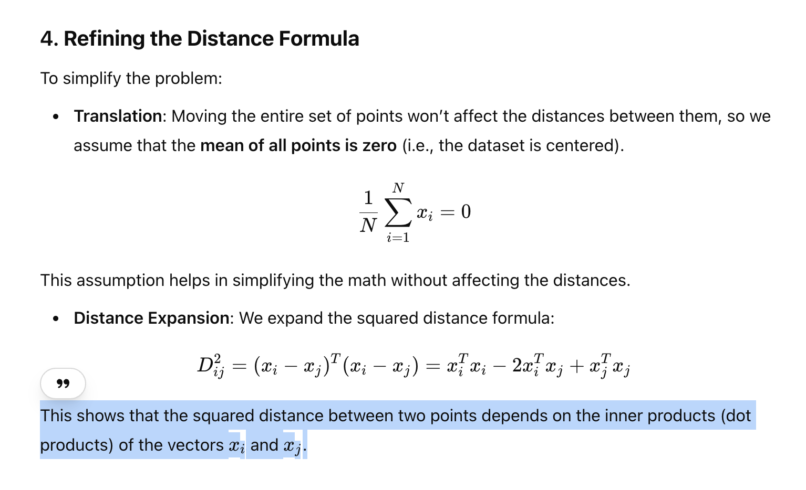
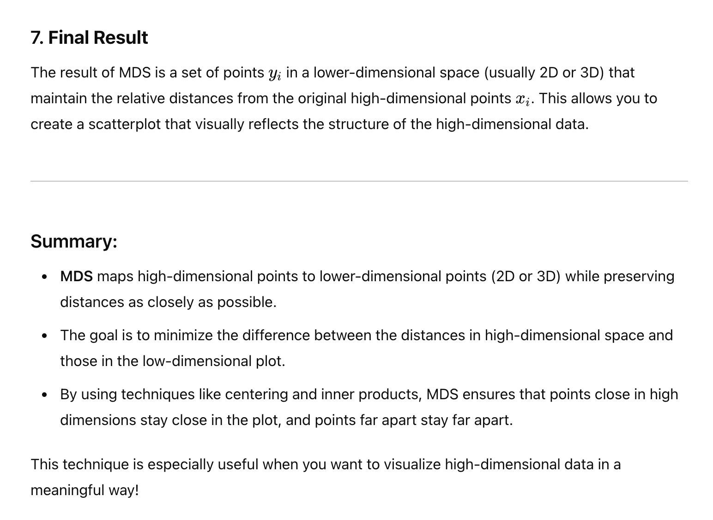

# Multi Dimensional Scaling
## Page 122
- relational distance between data points
- like distance between two cities
 
 # What is MDS

# Distance

# L2 norm depends on dot product of input and output

# centering using Identity

# Summary
