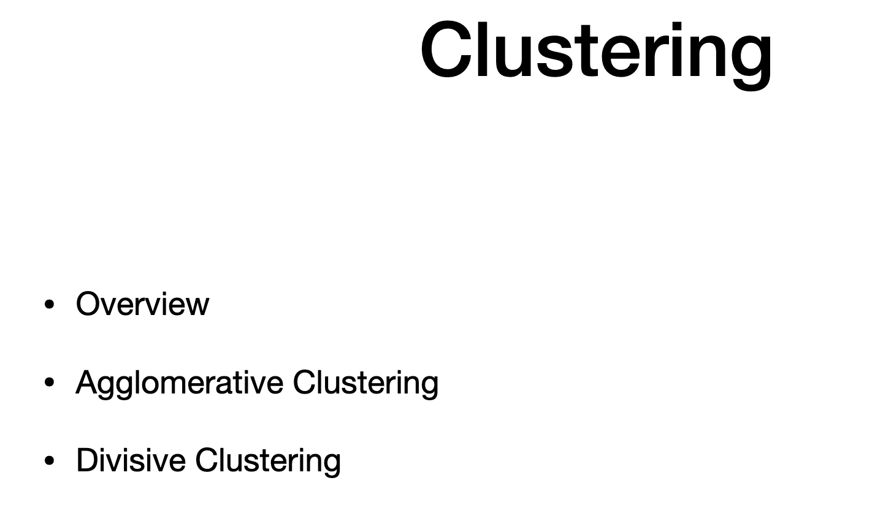
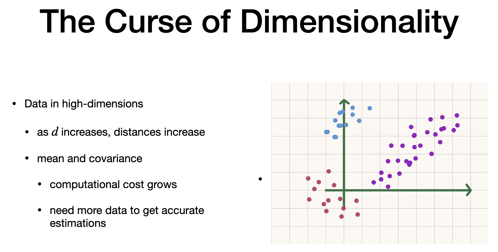
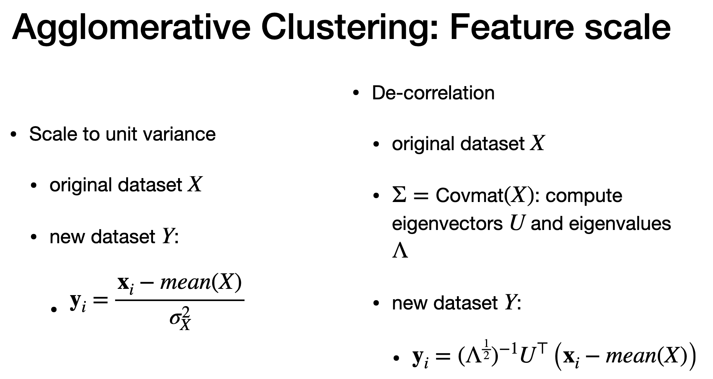
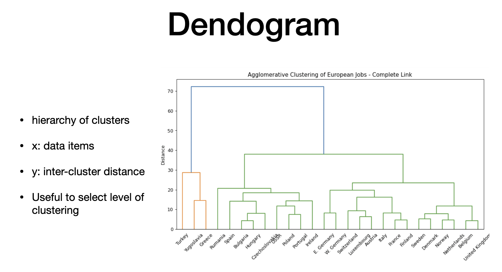

# Agenda

- clustering - high dimesnional data

# Curse of dimensionality

> - if number of features increases, its a curse
> - data item become sparse
> - that leads to much bigger data sets for covariance
> - also, leads to histogram being sparse
> - grouping into blobs allows summarization
> - high diemsniona, blobs are tough to spot
> - PCA and PCOA(to plot)

# Clustering

> - this lesson focus on how to find "Blobs" through clustering
> - can be pre-processing step to feature vector that can be used in featuring process
> - feature vector from this can be used as input to other process(in assignment)
> Cluster Paramters
> - representive sample for cluster
> - assignment of members to a cluster
> - number and evaluation

# Types

> 1. Divisive - start whole and divide
> 2. Agglo - start small and merge

# Divisive

> - recusive split big cluster
> - challenge - splitting criteria, what cluster to split and where to split
> -  depends on application

# Agglomerative

> - start smaller and repeating merge cluster
> - merge cluster with smaller inter cluster distance
> - challenge is inter cluster distance
> - we need to find cluster pairs with small distance
> - select pair of items from each cluster

# Inter cluster distance

> - **Single link : **minimum distance between A and B (orangle link) - produce **extended cluster**
> - **Complete link :** maximum distance between A and B - purple link - likely produce **rounded cluster**
> - **Group Average Cluster:** Average distance between elements - likely produce rounded cluster

# Feature scaling

> - features needs scaling, so distance are appropriate 
> - if unit of measurement is different, its weight will differ for the same quantities
> - 1. Scale each feature to unit variance (dataset  value - mean / variances)
> - 2. correlation: use eigen vector and value and form new dataset is formed by eigen value inverse X Eigen vectors tranpose X (dataset - mean)

# Dendogram

> - jobs in europe
> - x axis - countries in 1979
> - y axis 0 intercluster distance
> - stop clustering based on inter-clustering distance, number of clusters
> = we can use PCA or scatterplot to see patterns

# The end