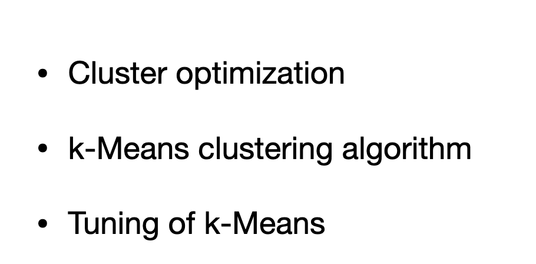

# K Means Clustering

# Clsutering

> - K means is agglomoretric algorithm

# Math

> - distance between xi (data) and cluster center(c(i))
> - "pi" function is square distance between datapoint to center
> - delta is indicator | if 1 belong to cluster, 0 is otherwise
> - each item belong to one cluster, so summation of delta for all items in one cluster "j" =1
> since cluster needs to have atleat one item, summartion of "i"(Data points) for each cluster > 0 
> - memership "delta" and center "c" that minimize "phi"
> - hard to solve
> - approximate algorithm based on
> 1. cluster center for clustering, each item belong to cluster, we can get "delta"
> 2. cluster center is mean of cluster points (c (i))

# K Means Clustering

- approx algorith below
- cluster quality isn "highly dpeendant on Initialization"
- iterative loop and enter have significant changes
- when cluster center dont change much, we have converged.
- Algo:
- 1. assign "x" to closet center
- 2. every cluster should have atleat one data point. gping through empty cluster and assign item far from center
- 3. re-calculating cluster center to mean of data point in it

# CONS ok K means:
- covnerge to local minimum
- Not global minimum . (as result is dependant on initialization)
- frequenyly prodcues single element cluster if "k" is large
- produce spread out clusters

# Workaround
 - use temp cluster to assign anamoly item that is too far into temp cluster so it doesnt pull the cluster center too far.
 - reassign it back to original center only the center is fixed.

# Tuning

# More CONS ok K means:
- poor initialization. execute k-0 measn multiple time with different initialization and pick the best one
- K Means ++ => choose rndom point , then select (k-1) randomly selected from probability distributoion
- x - center . distance to center x.square sum

# Tuning -2

- selection of number of clusters (k)
- k is too big, many isolated clusters
- k - too small - spread cluster with high cost "phi"
- phi during initializaton is high and gradually reduces with more "k"
- "ELBOW CHART" -elbow is the best point (KNEE - at this point, cost doesnt reduce much)

# Another way to evalaute
- similarity matrix
- when "well matched", they are assigned to "+1" and not matched is assigned to "-1" (indicate poor selection of k)

- if clusters are input to other process, the performance of other process to choose the number of clusters

---
# The end