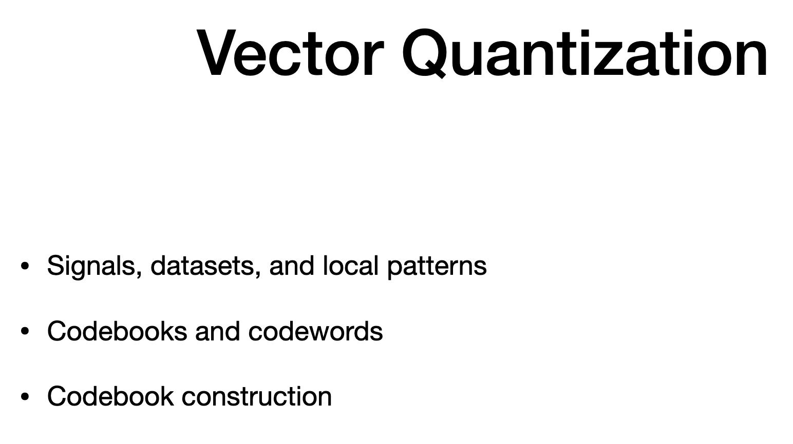
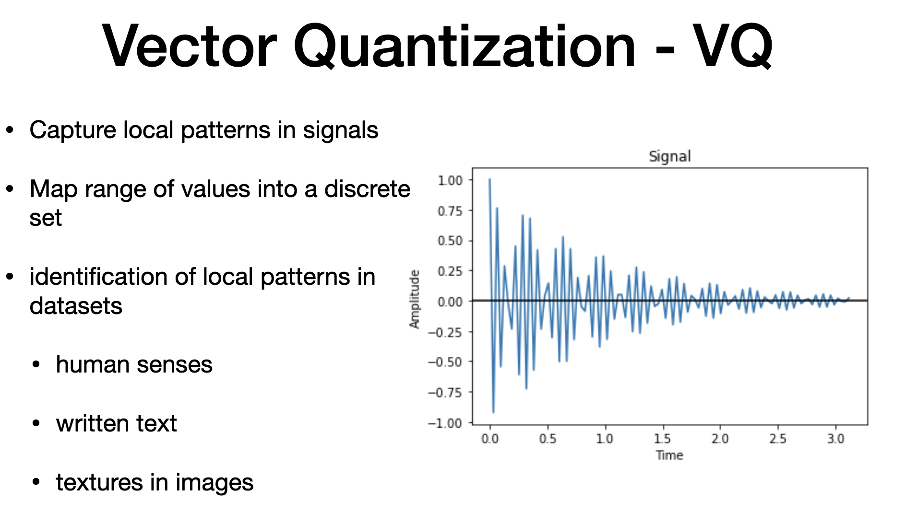
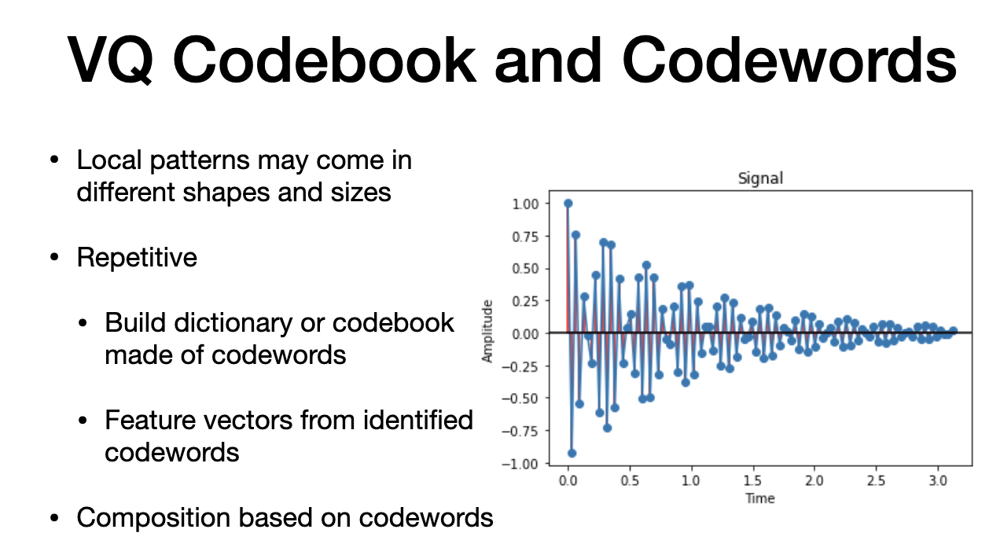

# Agenda

# VQ - vector quantization

> - method to capture local pattern in signals
> - continuos values to discrete set
> - used for signal processing
> - repititive **local pattern **is possible in signals (oscillation of the signals)
> - signal changes when car hits a block in the road
> - spot local patterns (like written letters to distinguish two alphabets)
> - patterns like bark, stripes in animals

# VQ-2

- speech recognition
- variation in frequency
- split a words into Phenemes (learning = 2 phonemes - "learn" "ing)
- smart watch use for swing hands during walk

### CONS of Signal (VQ)
- local patterns come in different size and shape

-  since local paaterns are repititive.
-  we can set "code words" - word is called "code words"
-  dictionary is "code book"
-  we can use code words to capture repitiion from words or from speech
-  inversely, we can compose image from code words

# Code Books

# Construction of code book

- 1. quantize data into equal size patches ()green line)
- 2. each patch to a vector (each patch has d=10 samples)
- 3. overlapping patches will be helpful
- 4. we can collect into from many signals
- Part -2
- 1. buildign cluster out of data set (k-means)
- 2. each cluster center is "code- word"

# Characterization of new patch

> - we use code book to characterize new signal
> - split new signal into equal patch
> - convert to d-dimesnional vector
> - each vector associated to closet "code-word"
> - sequence is histogram.
> - histogram is k-dim vector (set of features for secondary process, iek classification)

# Patches in different domains

> - different shapes of signal
> - patch of "d" samples
> - grey scale image - it is square root of d ** 2
> - color images has three channel so d is divided by 3 and then multiple by three channel
> - accelerator = 3 * d/3, for each signal has d/3 elements

---
# The end