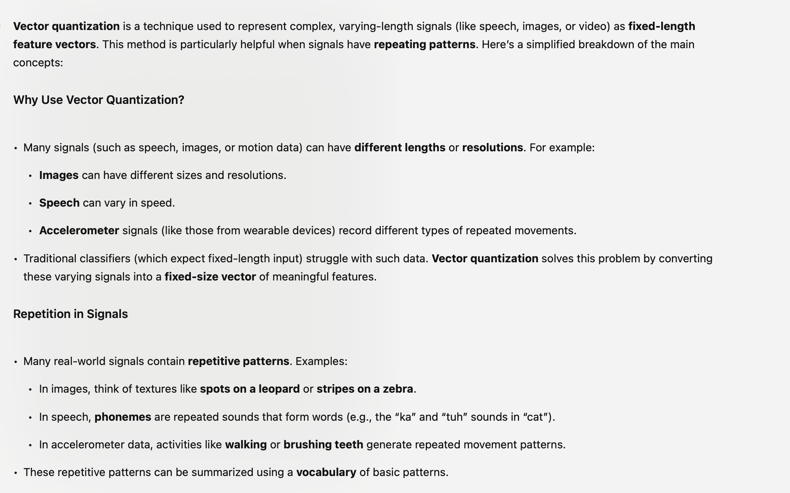
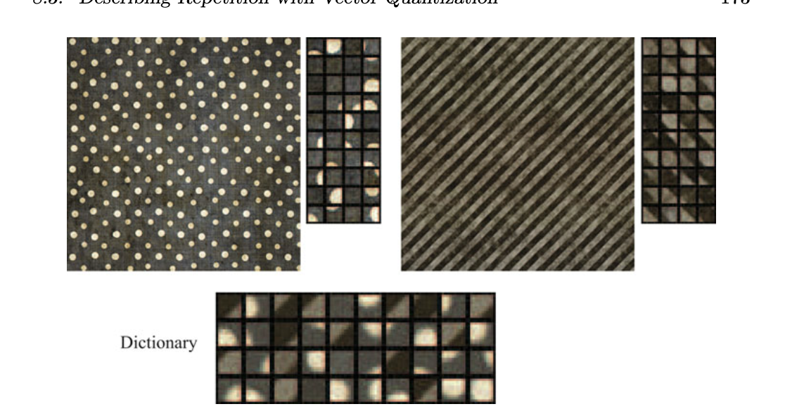
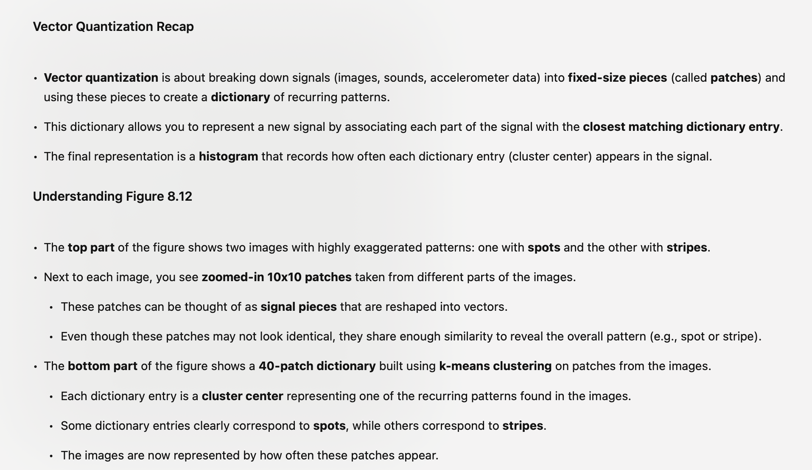
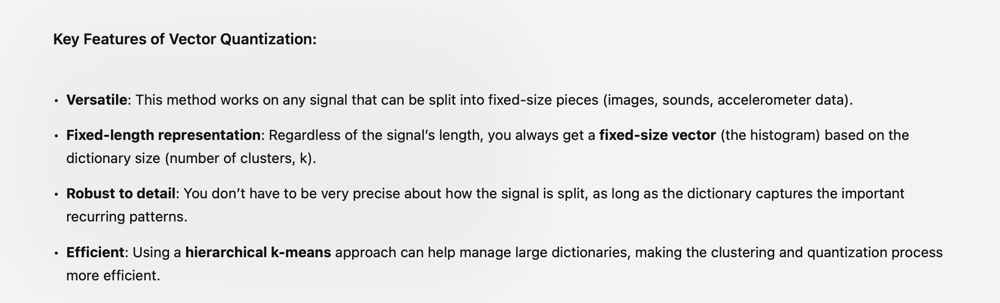

# Intro

# More about 

This is good

> Common dictionary to represent both dots and strips
> 
> 

# Cons
Two Major Limitations:

	1.	Loses information about arrangement: Vector quantization doesn’t capture where in the signal the patches appear. For instance, **it can tell you if an image has spots or stripes, but not their exact location.**
	2.	Loss of detail: Replacing patches with cluster centers results in **some loss of detail, w**hich can lead to classification errors. However, this loss can be mitigated by using multiple dictionaries and applying a voting scheme to improve classification accuracy.